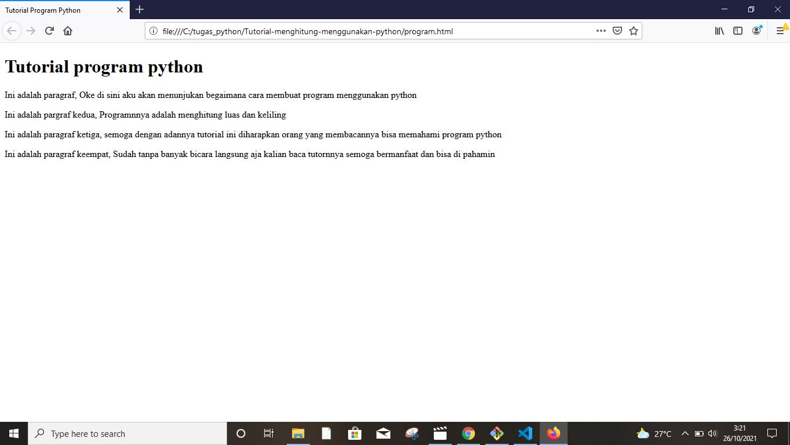
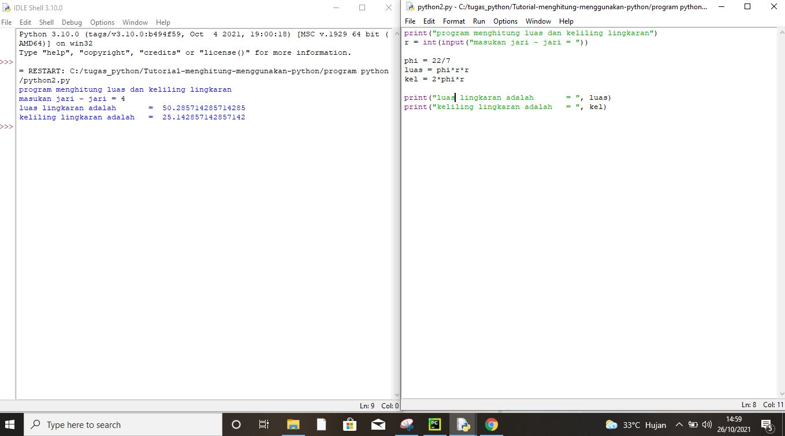
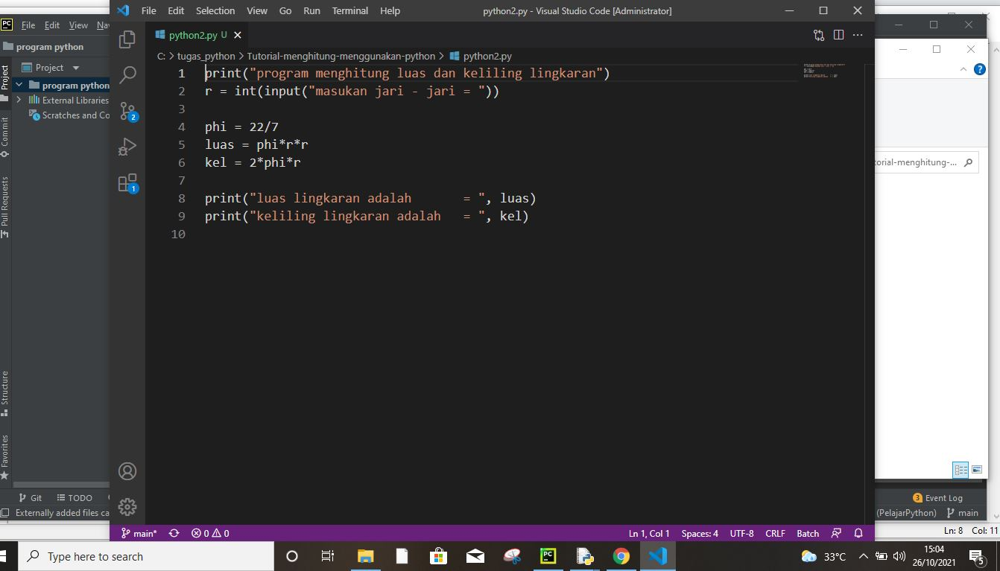
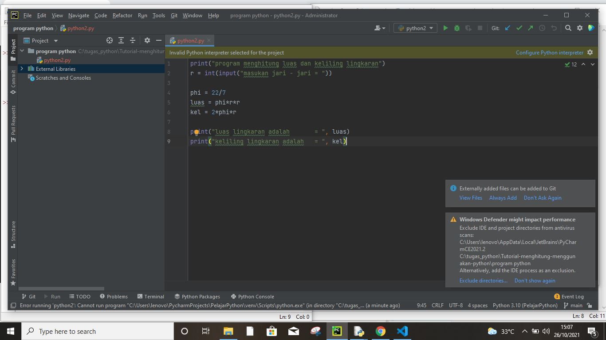
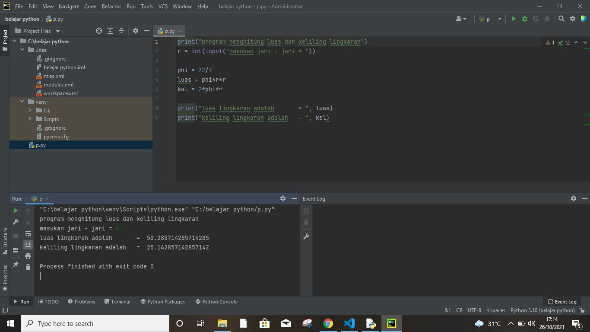

# Tutorial-menghitung-menggunakan-python
## Tutorial membuat program untuk menghitung luas dan keliling lingkaran menggunakan python

### Membuat paragraf 
kode tag paragraf adalah'
'
Ini adalah tampilannya

hasil kodingan di pytho'
'

hasil kodingan di pytho + Vision code'
'

hasil kodingan di pytho + Pycharm'
'

1. Flowchart
Proses mulai dan selesai kita menggunakan simbol terminal sebagai tanda awal (start) dan akhir (finish) pada proses tersebut.
Untuk inisialisasi variabel kita gunakan simbol proses, karena menunjukan kegiatan yang dilakukan oleh komputer.
Untuk memasukan nilai jari-jari (r) kita menggunakan simbol input karena nilai tersebut akan dimasukan oleh user.
Pendefinisian rumus luas lingkaran menggunakan simbol proses.
Terakhir untuk menampilkan hasil perhitungan luas lingkaran kita menggunakan simbol output.'
'

2.  Pseudocode
Berikut ini contoh penerapan algoritma menghitung luas lingkaran kedalam bentuk pseudocode:

Algoritma_menghitung_luas_lingkaran

deklarasi:
var : r :integer;
var phi:luas : float;

deskipsi:
read(r);
phi <- 3.14;
luas <- phi*r*r;
write (luas);'
'

Sekian dari saya jika ada kekurangan saya minta maaf semoga bermanfaat'
'

Tambahan foto eksekusi program Python + Pycharm'
'
